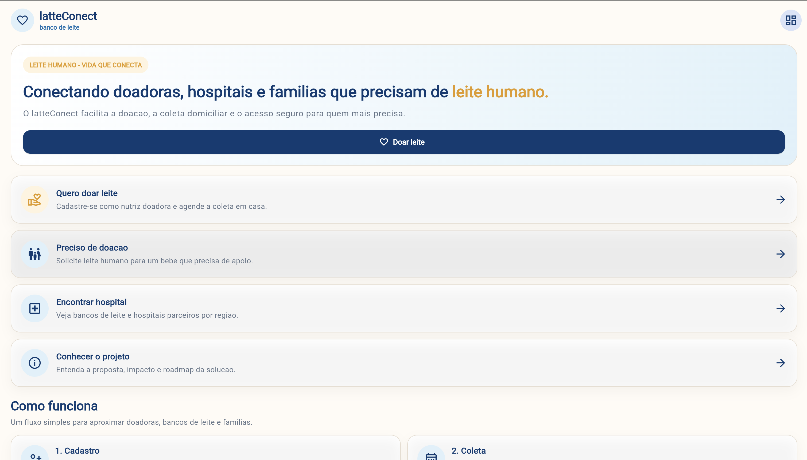
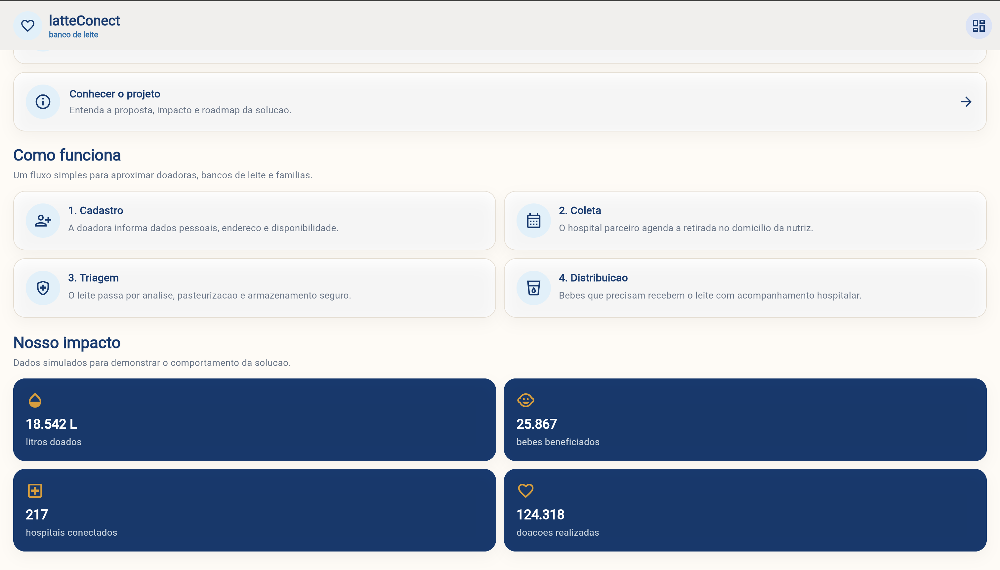
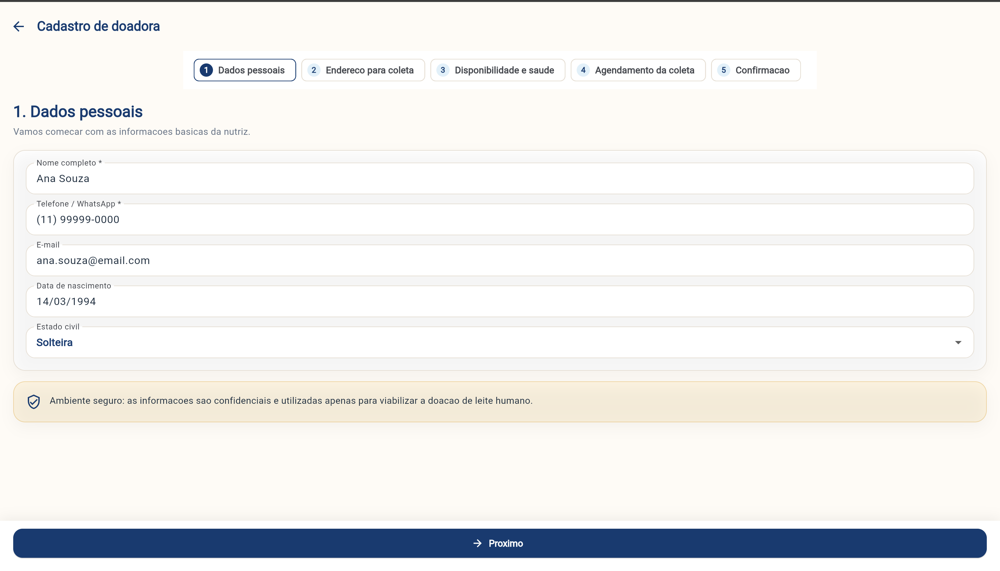
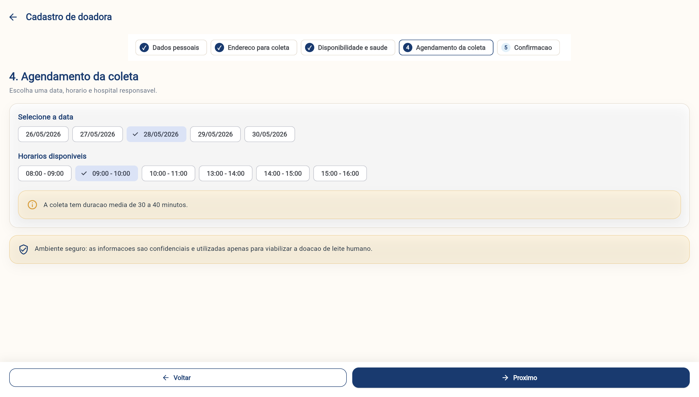
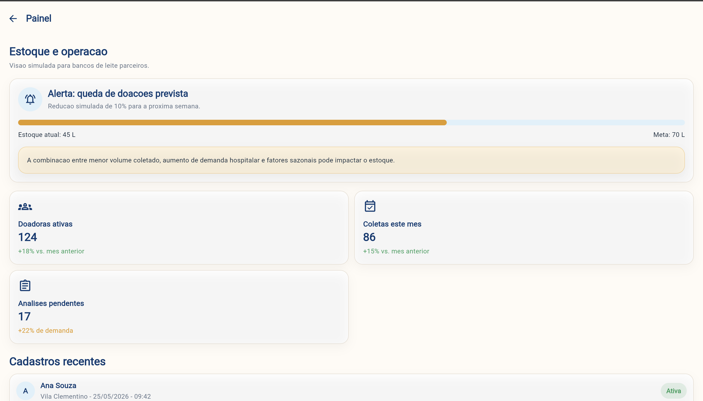
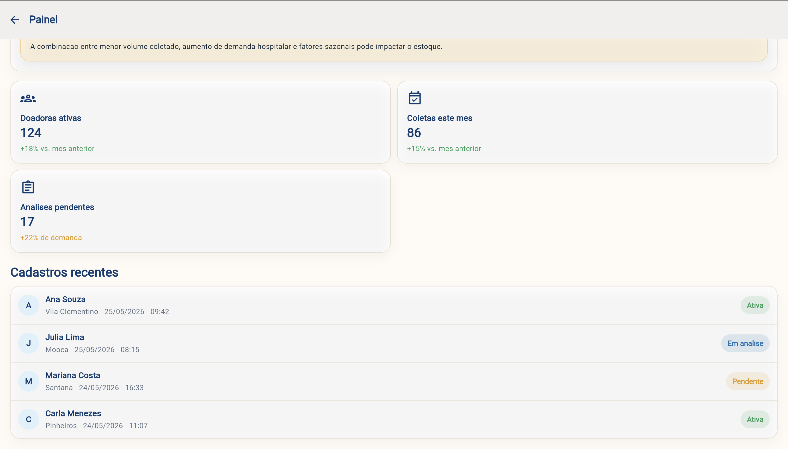

# latteConect

MVP Android em Flutter para conectar nutrizes doadoras, bancos de leite humano, hospitais parceiros e familias que precisam de doacao.

## Identificacao

- Projeto: latteConect
- Equipe: latteConect
- Integrantes atuais: Vitor Amorim, Felipe Takara e Lucas Campos Salles
- Repositorio GitHub: https://github.com/Felipetkr/Kotlin-sprint-3.git

## Objetivo do aplicativo

O latteConect facilita o cadastro de nutrizes doadoras, o agendamento de coleta domiciliar, a solicitacao de leite humano por familias/hospitais e a consulta de hospitais parceiros. Nesta Sprint, o app usa dados mockados e nao depende de API, Firebase, banco local ou backend.

## Telas implementadas

- Tela inicial: apresenta a proposta, atalhos principais, fluxo de funcionamento e indicadores de impacto.
- Cadastro de doadora: fluxo em cinco etapas com dados pessoais, endereco, disponibilidade, saude, agendamento e confirmacao.
- Solicitacao de doacao: formulario simulado para familias/hospitais registrarem necessidade de leite humano.
- Hospitais parceiros: lista mockada de bancos de leite com estoque, demanda, distancia e navegacao para detalhes.
- Detalhe do hospital: recebe parametro pela rota e exibe endereco, contato, estoque e horarios disponiveis.
- Painel: dashboard mockado com estoque atual, alerta de queda prevista, metricas e cadastros recentes.
- Sobre o projeto: problema, solucao, diferenciais competitivos e roadmap das Sprints 3 e 4.

## Prints das telas

Prints reais do aplicativo rodando no emulador.








## Evidencia em video

Video de navegacao do aplicativo:

https://youtu.be/LdUtkl3F49s

## Dados mockados

Os dados simulados ficam centralizados em `lib/data/mock_data.dart` e representam:

- acoes principais da tela inicial;
- etapas do fluxo de doacao;
- estatisticas de impacto;
- hospitais parceiros;
- metricas do painel;
- cadastros recentes;
- solicitacoes de doacao.

## Organizacao do codigo

```text
lib/
  config/        rotas nomeadas
  data/          listas e objetos mockados
  models/        modelos de dados
  screens/       telas navegaveis
  theme/         cores e tema visual
  widgets/       componentes reutilizaveis
```

## Como executar

1. Abra a pasta do projeto no Android Studio ou VS Code.
2. Rode `flutter pub get`.
3. Inicie um emulador Android ou conecte um celular.
4. Rode `flutter run`.

Para validar antes da entrega:

```bash
flutter analyze
flutter test
flutter run
```

## Observacao sobre a entrega

O enunciado da Sprint pede projeto Flutter navegavel com dados mockados. Esta versao foi preparada em Flutter e preserva a ideia visual das telas fornecidas, mas sem integrar API, Firebase, banco local ou backend.
